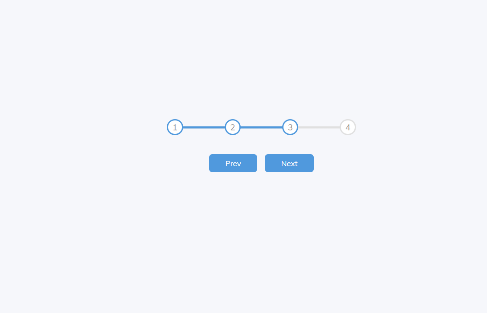

# Progress Steps

This project is an interactive progress bar with multiple steps that visually update as users click "Next" or "Prev" buttons. It is built using HTML, CSS, and JavaScript, and serves as a demonstration of dynamic progress tracking and DOM manipulation.

## Features

- Interactive progress bar that fills as users navigate through the steps.
- "Next" and "Prev" buttons to control the step progression.
- Smooth CSS transitions for a visually appealing user experience.
- Responsive design for different screen sizes.

## What I Learned

- Leveraged Flexbox for responsive layout design.
- Implemented JavaScript event handling to update progress dynamically.
- Applied CSS transitions to enhance animations and user interaction.

## Technologies Used

- **HTML**: Structure of the progress bar and buttons.
- **CSS**: Styling, transitions, and layout using Flexbox.
- **JavaScript**: Event handling and DOM manipulation for interactive features.

## How to Run

1. Clone or download the repository.
2. Open `index.html` in your preferred browser.
3. Use the "Next" and "Prev" buttons to see the progress bar in action.

## Screenshot

## Future Improvements

- Add more steps to the progress bar for larger workflows.
- Introduce animations for each circle when it becomes active.
- Enhance styling to make it more visually distinct.

## License

This project is open source and available under the [MIT License](LICENSE).
